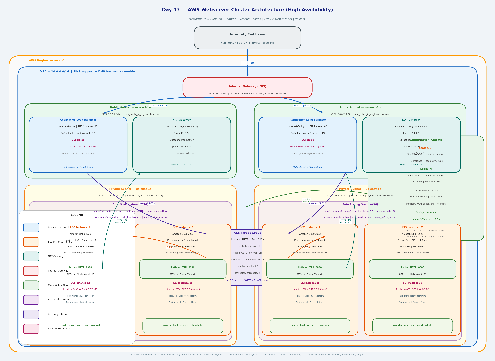

# Day 17 — Manual Testing of Terraform Code

> **Book:** Terraform: Up & Running by Yevgeniy Brikman  
> **Chapter:** 9 — How to Test Terraform Code  
> **Today's focus:** Manual testing — you run every command, read every output, document every result

---

## Architecture Diagram



### How to Read This Diagram

Start at the top and follow the traffic downward. Every arrow is a connection you will manually verify.

Internet / End Users
        |
        | HTTP :80  <-- you curl this yourself in Step 13
        v
Internet Gateway (IGW)
        |
        v
  ╔═════════════════════════════════════════╗
  ║           VPC — 10.0.0.0/16            ║
  ║                                         ║
  ║  ┌──────────────┐   ┌──────────────┐   ║
  ║  │ Public 1a    │   │ Public 1b    │   ║  <- ALB nodes live here
  ║  │  [ALB node]  │   │  [ALB node]  │   ║
  ║  │  [NAT GW]    │   │  [NAT GW]    │   ║  <- one NAT GW per AZ
  ║  └──────┬───────┘   └──────┬───────┘   ║
  ║         │ forward :8080    │            ║
  ║  ┌──────▼──────────────────▼───────┐   ║
  ║  │       Auto Scaling Group        │   ║
  ║  │  ┌──────────┐  ┌──────────┐    │   ║
  ║  │  │ EC2 #1   │  │ EC2 #2   │    │   ║  <- private subnets, no public IP
  ║  │  │ :8080    │  │ :8080    │    │   ║
  ║  │  └──────────┘  └──────────┘    │   ║
  ║  └─────────────────────────────────┘   ║
  ║         |                              ║
  ║    [NAT GW] HTTPS :443 outbound        ║  <- EC2 -> internet for pkg updates
  ╚═════════════════════════════════════════╝


**What each component is and why it exists:**

| Component | Where it lives | Why it's there |
|-----------|---------------|---------------|
| Internet Gateway | VPC level | The bridge between your VPC and the internet |
| Public Subnets (x2) | One per AZ | ALB and NAT Gateways need a public IP to be reachable |
| Application Load Balancer | Public subnets | Receives HTTP :80, distributes to EC2 instances |
| NAT Gateways (x2) | Public subnets, one per AZ | Let private-subnet instances reach the internet — without being reachable from it |
| Private Subnets (x2) | One per AZ | EC2 instances have no public IP — unreachable directly |
| Auto Scaling Group | Private subnets | Maintains desired instance count; replaces unhealthy instances |
| EC2 Instances | Private subnets | Run the Python HTTP server on :8080; respond "Hello World v2" |
| Target Group | Logical (not subnet-specific) | ALB registers instances here; health checks run here |
| Security Groups | Attached to ALB and EC2 | Define exactly who can talk to what on which port |

**Manual test steps mapped to diagram:**

- **Steps 5–6:** VPC and subnet rectangles — do they exist with the right CIDRs and AZs?
- **Step 7:** Security group arrows — are the rules exactly as drawn, with nothing extra?
- **Steps 8–9:** ALB box and Target Group — is the ALB active? Are instances healthy?
- **Step 10:** ASG box — min=2, desired=2, max=6?
- **Steps 12–13:** Follow the top arrow with `curl` — does it return "Hello World v2"?
- **Step 14:** Delete one EC2 box manually — does the ASG draw a new one?


## Project Structure

terraform-day17/
├── main.tf                           # Root: calls networking, security, compute modules
├── variables.tf                      # All input variables with validation
├── outputs.tf                        # Values you need for manual testing commands
├── architecture.png                  # The diagram above
├── README.md                         # This file
│
├── modules/
│   ├── networking/                   # VPC, subnets, IGW, NAT GW, route tables
│   │   ├── main.tf
│   │   ├── variables.tf
│   │   └── outputs.tf
│   │
│   ├── security/                     # Security groups with explicit, minimal rules
│   │   ├── main.tf
│   │   ├── variables.tf
│   │   └── outputs.tf
│   │
│   └── compute/                      # Launch Template, ASG, ALB, Target Group, Listener
│       ├── main.tf
│       ├── variables.tf
│       ├── outputs.tf
│       └── user_data.sh.tpl          # Bootstrap script: Python HTTP server as systemd service
│
├── environments/
│   ├── dev/terraform.tfvars          # t3.micro, min=2, max=4
│   └── prod/terraform.tfvars         # t3.small, min=2, max=6
│
└── scripts/
    ├── manual_test_checklist.md      # 17-step checklist — YOU fill this in
    └── cleanup_verification.md       # Post-destroy commands — YOU run each one

## What Chapter 9 Says About Manual Testing

Brikman's argument is this: before you can write automated tests, you must know what correct behaviour looks like. You learn that by deploying the infrastructure yourself, poking it, observing it, and documenting what you find.

Manual testing catches things automated tests often miss entirely:

**Console drift** — someone added a "temporary" SSH rule to a security group via the Console. `terraform validate` does not catch it. `terraform plan` does — but only if you run it and read it.

**Functional gaps** — a security group Terraform created successfully but with the wrong port passes provisioning verification. Only `curl` catches it.

**State inconsistency** — if `terraform plan` shows changes immediately after a fresh apply, something is wrong. This is one of the most important manual checks and one automated tests rarely cover.

**Regression surprises** — a tag change triggering a full resource replacement is a design problem you discover by reading the plan carefully, not by running a test suite.


## Prerequisites

| Tool | Minimum version |
|------|----------------|
| Terraform | >= 1.6.0 — `terraform version` |
| AWS CLI v2 | 2.x — `aws --version` |
| curl | any — `curl --version` |

AWS credentials:
```bash
aws configure
```

## How to Deploy

```bash
# 1. Initialise — read the output, check for errors
terraform init

# 2. Validate — must return "Success! The configuration is valid."
terraform validate

# 3. Plan — READ EVERY RESOURCE BLOCK before proceeding
terraform plan -var-file="environments/dev/terraform.tfvars"

# 4. Apply — Terraform shows the plan again; type "yes" only after reading it
terraform apply -var-file="environments/dev/terraform.tfvars"
```

After apply completes, note your outputs:
```bash
terraform output alb_dns_name      # used in Step 12 and 13
terraform output target_group_arn  # used in Step 9
terraform output asg_name          # used in Step 10
```

## The Manual Testing Checklist

Open `scripts/manual_test_checklist.md`.

Work through it one step at a time. Each step gives you:
- The exact command to run
- What to look for in the output
- Space to write what you actually saw
- A PASS / FAIL box to tick

**The 17 steps across 5 categories:**

| Category | Steps | What you are checking |
|----------|-------|----------------------|
| Provisioning verification | 1–4 | init, validate, plan, apply |
| Resource correctness | 5–11 | Console: VPC, subnets, SGs, ALB, TG, ASG, tags |
| Functional verification | 12–14 | DNS resolves, curl returns response, ASG self-heals |
| State consistency | 15–16 | No drift after apply, state file matches reality |
| Regression check | 17 | Small change shows only that change in plan |


## Security Group Verification — Step 7

This is one of the most important manual tests. Open the AWS Console, go to EC2 → Security Groups, and verify the rules are **exactly** as below — no more, no less.

**ALB Security Group (`alb-sg`):**

Inbound rules:
  Type: HTTP   Protocol: TCP   Port: 80    Source: 0.0.0.0/0

Outbound rules:
  Type: Custom  Protocol: TCP   Port: 8080  Destination: instance-sg (by SG ID)


**Instance Security Group (`instance-sg`):**

Inbound rules:
  Type: Custom  Protocol: TCP   Port: 8080  Source: alb-sg (by SG ID)

Outbound rules:
  Type: HTTPS   Protocol: TCP   Port: 443   Destination: 0.0.0.0/0

Run this CLI command and read the output:

```bash
aws ec2 describe-security-groups \
  --filters "Name=tag:Environment,Values=dev" \
  --query "SecurityGroups[*].{Name:GroupName,Ingress:IpPermissions,Egress:IpPermissionsEgress}"


If you see any extra rules — a port 22 ingress, a `0.0.0.0/0` egress on all ports — that is drift. Document it, find where it came from, remove it, re-apply, and confirm the plan is clean.


## Cleanup

Open `scripts/cleanup_verification.md` and follow it after every test session.

```bash
# Always preview first
terraform plan -destroy -var-file="environments/dev/terraform.tfvars"

# Then destroy — type "yes" only after reading the plan
terraform destroy -var-file="environments/dev/terraform.tfvars"
```

Then run each CLI command in the cleanup guide to confirm zero orphaned resources.

**Why this matters:**

| Forgotten resource | Daily cost |
|--------------------|-----------|
| 1 NAT Gateway | ~$1.08 |
| 1 ALB | ~$0.19 |
| 2x t3.micro EC2 | ~$0.50 |
| **Total per forgotten day** | **~$1.77+** |

Terraform occasionally leaves orphaned resources when a destroy partially fails — a security group that cannot be deleted because an ENI still references it, or a NAT Gateway stuck in "deleting" state. The cleanup verification commands find them. Manual deletion and `terraform state rm` fix them.


## Multi-Environment Comparison

After testing dev, run through the checklist again with prod:

```bash
terraform apply -var-file="environments/prod/terraform.tfvars"
# work through all 17 checklist steps
terraform destroy -var-file="environments/prod/terraform.tfvars"
```

Document any differences between environments. Common findings:
- `t3.micro` (dev) vs `t3.small` (prod) — instance type visible in Console?
- CIDR `10.0.x.x` (dev) vs `10.1.x.x` (prod) — any routing conflicts if both run simultaneously?
- ASG max 4 (dev) vs 6 (prod) — does the self-healing test (Step 14) behave differently?

Every difference you observe manually becomes a test case you will automate in Chapter 10.


## Blog Post: The Importance of Manual Testing in Terraform

People new to Terraform often assume the testing story is the same as software testing: write unit tests, run the pipeline, trust the green check. That assumption misses a critical layer.

**The gap between what Terraform plans and what AWS creates** is where manual testing lives. Terraform can plan successfully against a configuration that, once deployed, has a security group open to the wrong port, a health check pointing at the wrong path, or a user data script that boots the instance but does not start the service. None of these show up in `terraform validate`. All of them show up when you `curl` the ALB or check the target group health.

### Provisioning verification is not the same as functional verification

Provisioning verification asks: did Terraform create the resources it claimed? You check this by reading `apply` output, running `terraform state list`, and looking at the Console. A successful apply is necessary but not sufficient.

Functional verification asks: do those resources actually work? You check this by using them — by resolving the DNS name, by curling the endpoint, by terminating an instance and watching the ASG replace it. A security group with an incorrect egress rule passes every provisioning check and fails the curl test.

Both questions must be answered. Manual testing is the only way to answer the second one before you have automated tests in place.

### The regression check reveals hidden coupling

When you add a tag or change a description and `terraform plan` shows a full resource replacement — an ASG destroyed and recreated, a launch template cycling all instances — you have discovered hidden coupling in your modules. That is a design problem.

You find it during manual testing because you are reading the plan carefully. Automated tests do not run `plan` and read it line by line. You do.

### State consistency is the most underrated check

Running `terraform plan` immediately after a fresh apply and expecting "No changes" is the single most useful manual test you can run. If it shows changes, something is wrong — a resource attribute that Terraform cannot fully control, an eventual-consistency issue with AWS, or drift from a previous session. Finding it during a manual test session means you fix it before it causes a production incident.

### Cleanup discipline is part of testing

Every resource left running after a test session is an implicit assumption about state. Assumptions about infrastructure state are what cause the hard-to-reproduce bugs that consume full days. The habit of destroying everything, verifying cleanup with CLI commands, and resolving any orphans immediately is not about cost. It is about maintaining a clean baseline you can reason about.

The most valuable output of a Day 17 manual test session is not the seventeen green check marks. It is the documented failures — what the actual output was, what was wrong, and how it was fixed. Each one becomes a test you can automate in Chapter 10.
