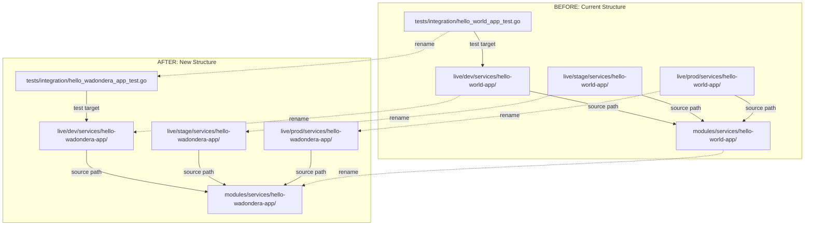
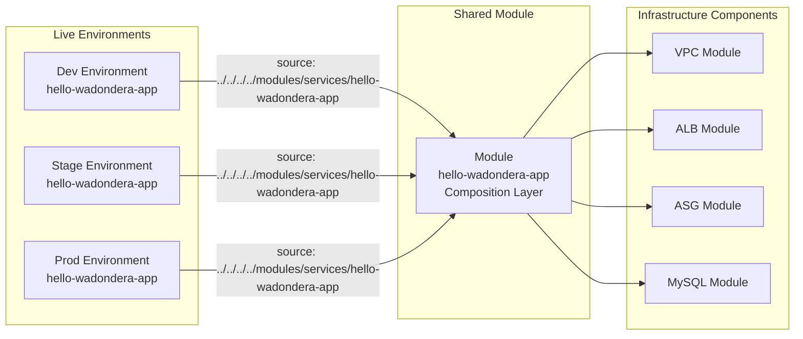
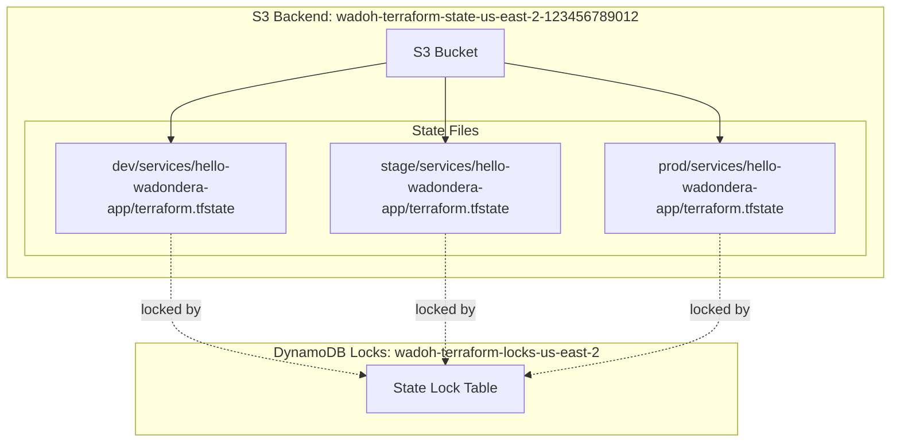
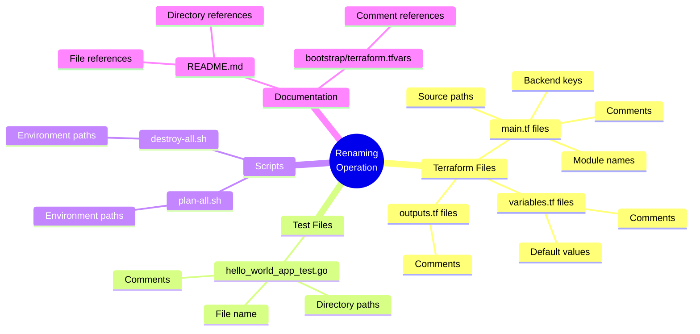
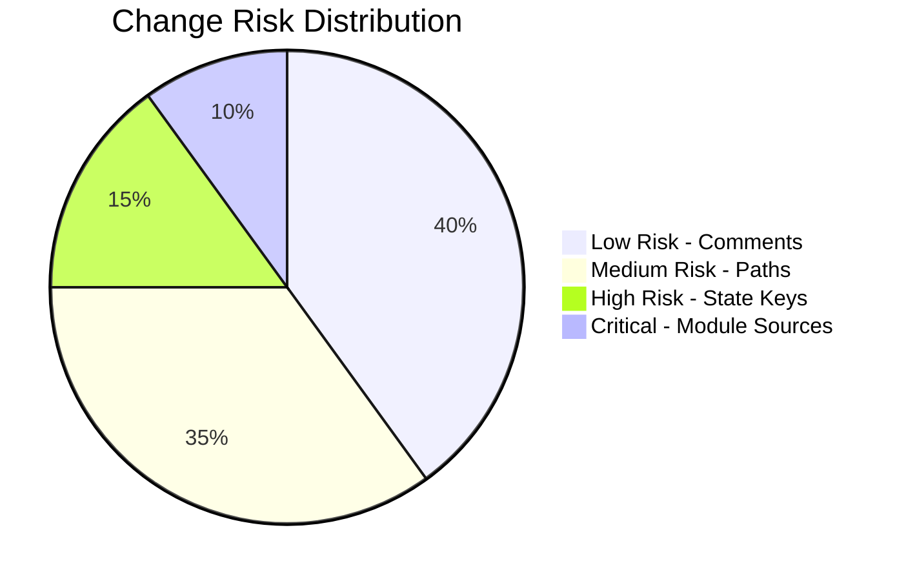

# Visual Renaming Architecture

## Directory Structure Transformation

## Module Reference Flow

## Backend State Key Mapping

## File Content Changes Summary

## Execution Phases

```mermaid
gantt
    title Renaming Execution Timeline
    dateFormat X
    axisFormat %s
    
    section Phase 1: Content Updates
    Terraform configs     :a1, 0, 5
    Test files           :a2, 5, 2
    Shell scripts        :a3, 7, 2
    Documentation        :a4, 9, 2
    
    section Phase 2: Directory Renaming
    Module directory     :b1, 11, 1
    Dev directory        :b2, 12, 1
    Stage directory      :b3, 13, 1
    Prod directory       :b4, 14, 1
    Test file            :b5, 15, 1
    
    section Phase 3: Verification
    Path validation      :c1, 16, 2
    Cross-ref check      :c2, 18, 2
    Final review         :c3, 20, 1
```

## Impact Analysis

### Files Modified: 15
- Terraform configuration files: 10
- Test files: 1
- Shell scripts: 2
- Documentation: 2

### Directories Renamed: 4
- Module directory: 1
- Live environment directories: 3

### Files Renamed: 1
- Test file: 1

### References Updated: 23+
- Module source paths: 3
- Backend state keys: 3
- Module names: 3
- Directory paths in scripts: 6
- Documentation references: 6+
- Comments and headers: 15+

## Risk Assessment

### Mitigation Strategy
1. **Comments (Low Risk)**: Cosmetic changes, no functional impact
2. **Paths (Medium Risk)**: Validated through verification phase
3. **State Keys (High Risk)**: Carefully updated to match new structure
4. **Module Sources (Critical)**: Triple-checked for correct relative paths

## Success Criteria

✓ All 23 todo items completed
✓ Zero broken references
✓ All module paths resolve correctly
✓ Backend configurations intact
✓ Infrastructure remains deployable
✓ Documentation reflects new structure